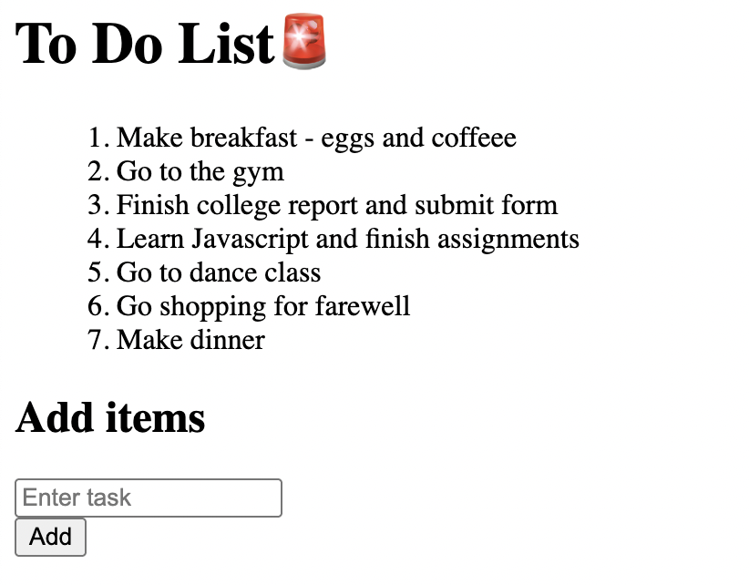

# TASK 1: Interactive To-Do List Application

## Objectives

- Use DOM manipulation to create, update, and delete list items.
- Attach event listeners for adding tasks and toggling their completion status
- Optionally store tasks in an array (or even in `localStorage` for persistence).

## Output:

### Adding an item:

#### Before:

#### After:

### Updating an item:

#### Before:

#### After:

### Deleting an item:

#### Before:

#### After:

### Toggle:

