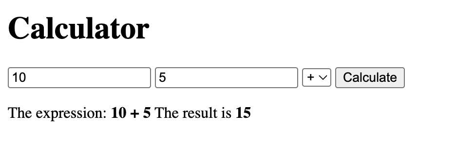
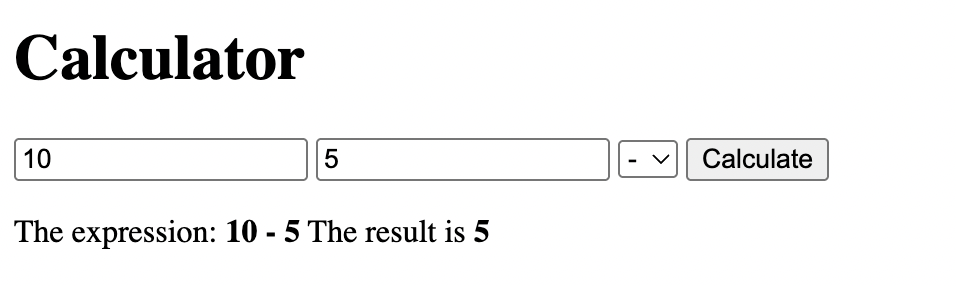
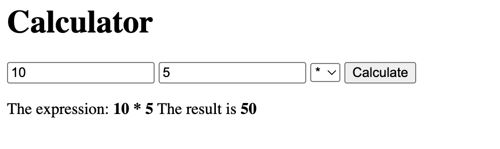
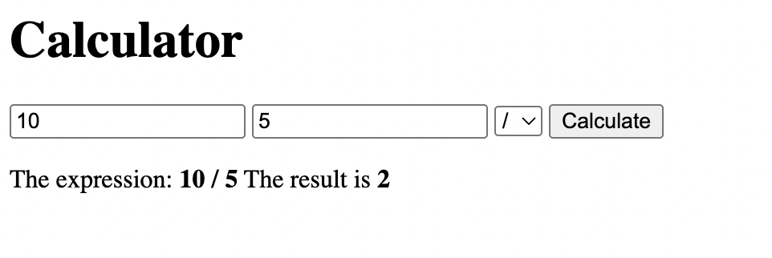
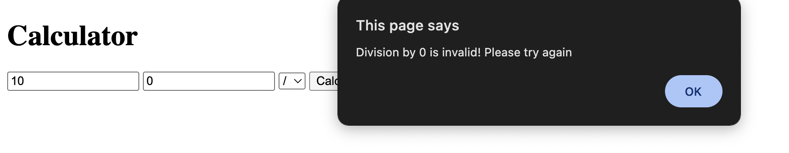

# TASK 2: Simple Calculator

## Objective:

- Create number and operator buttons in HTML.
- Use JavaScript to capture user input and perform calculations.
- Update the display dynamically as the user interacts with the calculator.

## Output:

### Addition:

### Subtraction:

### Multiplication:

### Division:

### Division by Zero Error:

