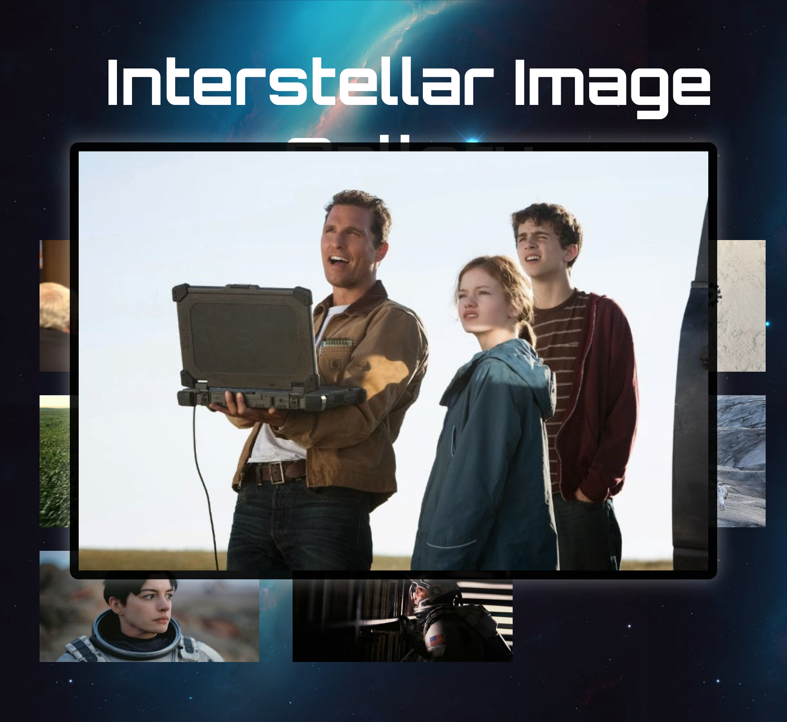

# TASK 3: Image Gallery Lightbox

## Objectives:

- Use event listeners to detect when a thumbnail is clicked.
- Dynamically update the modal content with the selected image.
- Toggle CSS classes to show/hide the modal and add transitions for smooth effects.

## Output:

### Image Gallery:

### Modal Popup (On click - with toggle):

