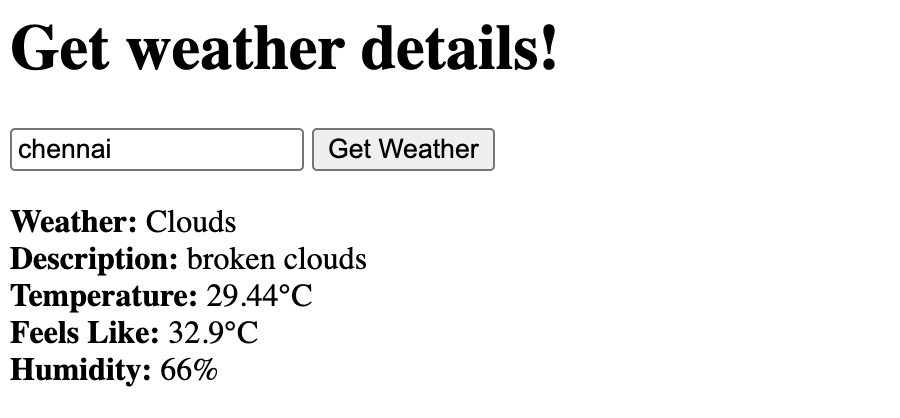
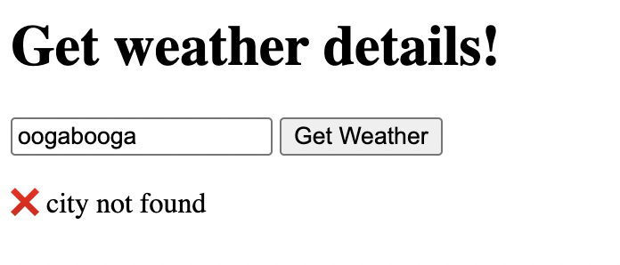

# TASK 4: Weather App with API Integration

## Objective

- Use the Fetch API to retrieve weather data from a public API (e.g., OpenWeatherMap).
- Parse the JSON response and update the DOM with temperature, humidity, and weather conditions.
- Implement error handling for invalid input or failed network requests.

## Output:

### Weather details for chennai:

### When Invalid city entered:

