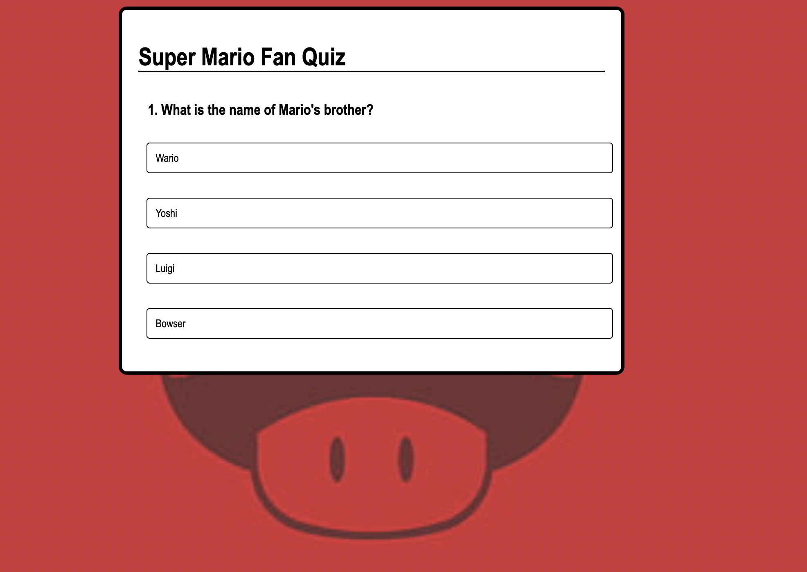
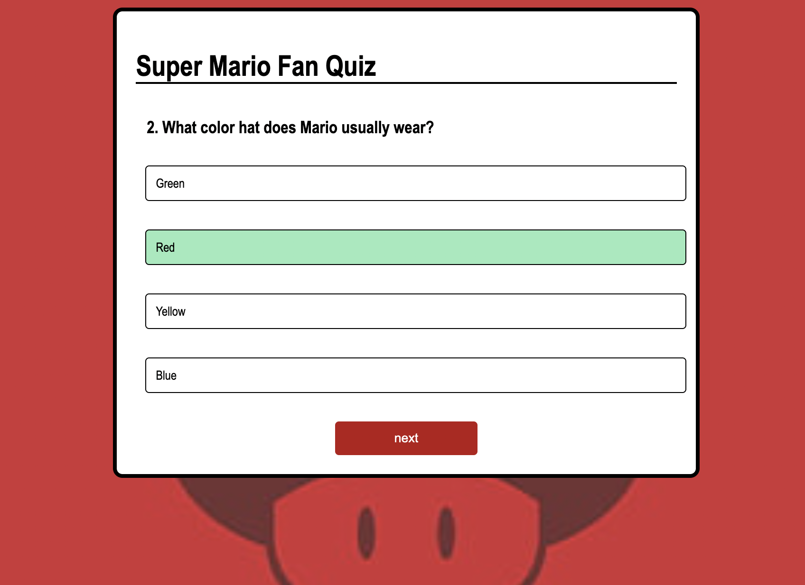
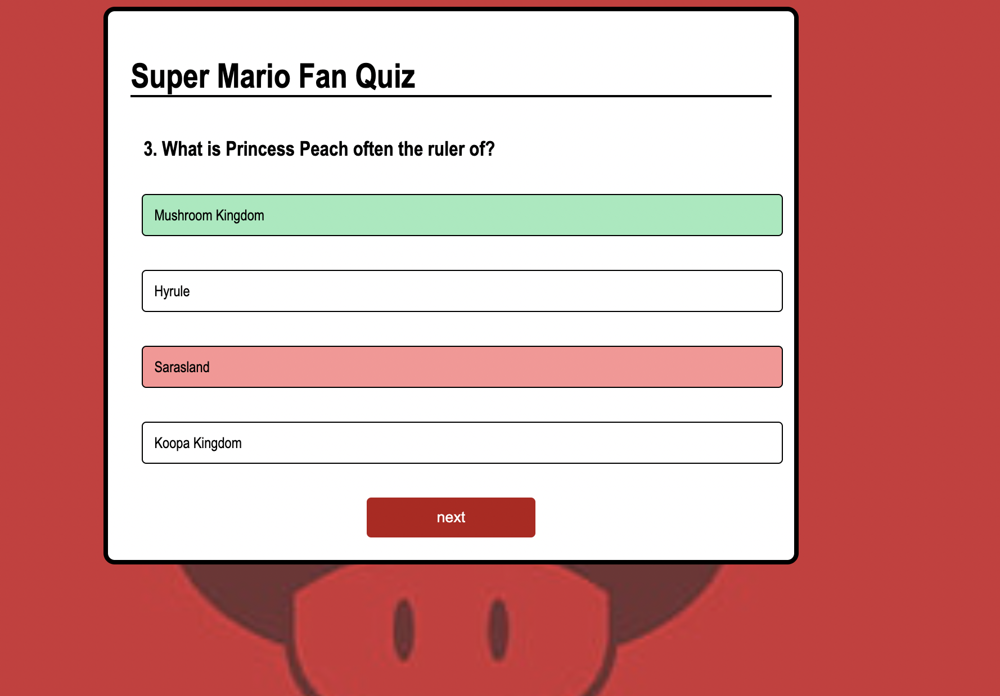
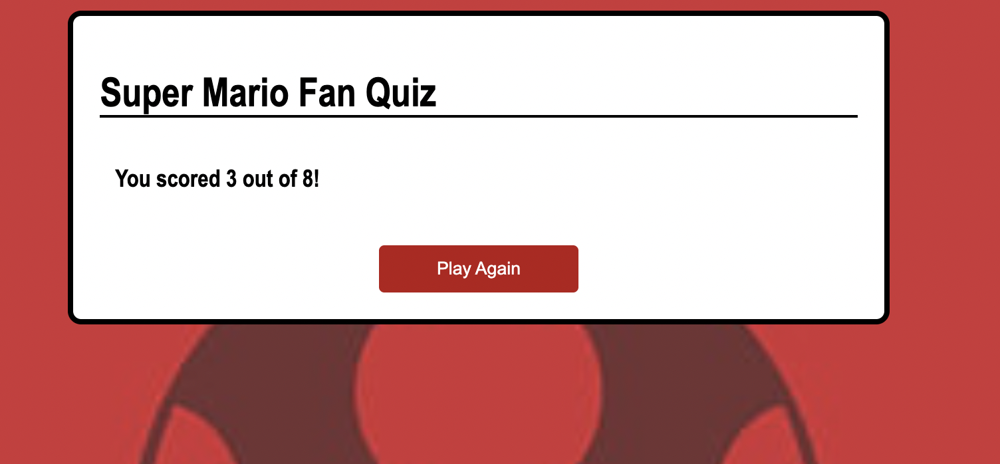

# TASK 5. **Dynamic Quiz Application**

## **Requirements:**
     - Store quiz questions and options in a JavaScript object or load them from an external JSON file.
     - Use event listeners to capture user selections and move through quiz questions.
     - Calculate and display the final score, providing feedback or explanations as needed.

## Output:

### Quiz layout:

### Correct Answer:

### Wrong Answer:

### Play again:
