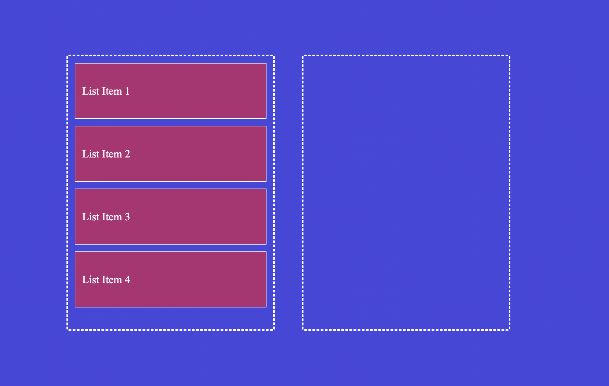
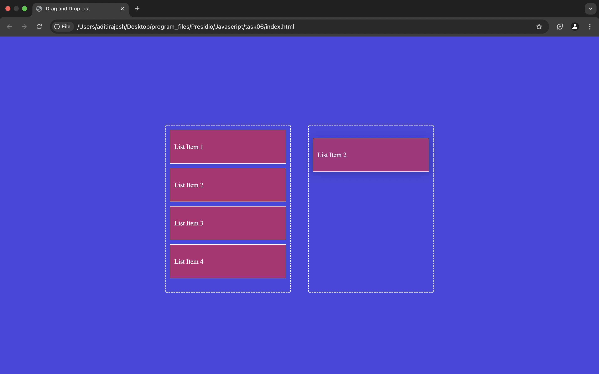
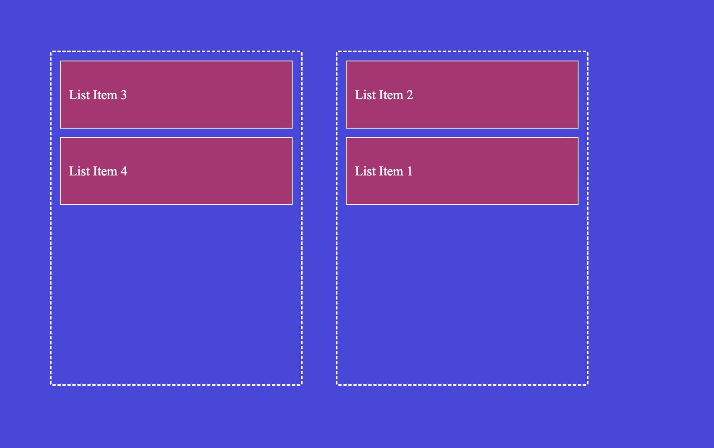

# TASK 6: **Drag and Drop List Reordering**

## **Requirements:**
     - Leverage the HTML5 Drag and Drop API to manage drag events.
     - Update the DOM to reflect the new order of items after a drop.
     - Provide visual feedback during drag operations (e.g., highlight potential drop targets).

## Output:

### List items:

### Drag:

### Drop:
