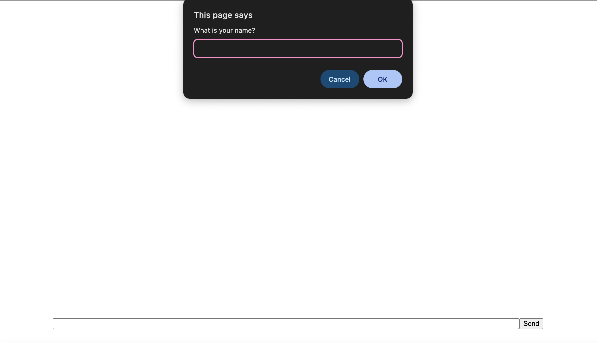
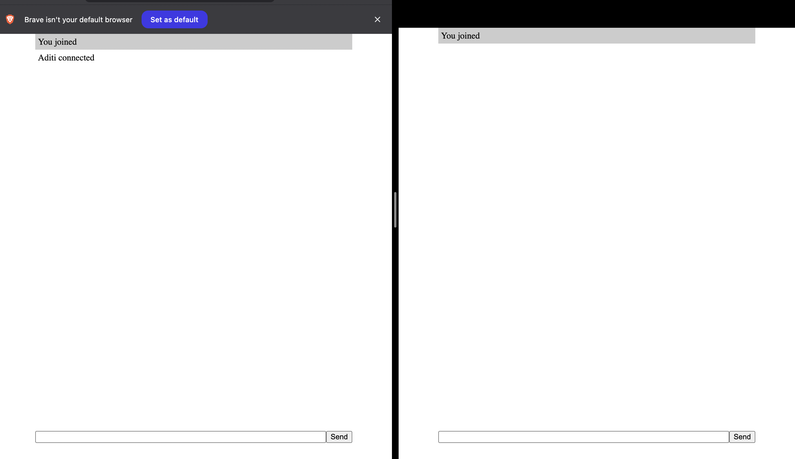
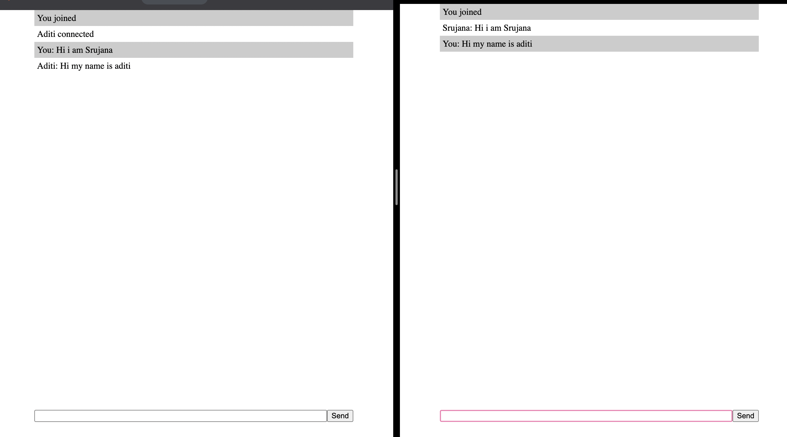
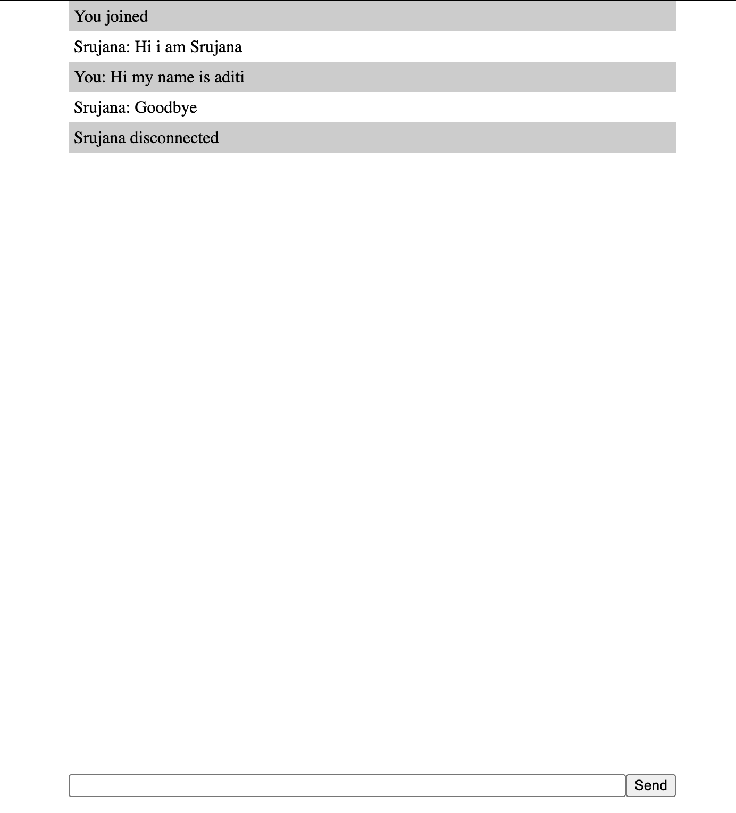

# TASK 7: **Real-time Chat Simulation**
## **Requirements:**
     - Create a chat window that displays messages as they are sent.
     - Use `setTimeout` or `setInterval` to simulate incoming messages.
     - Handle user input, display timestamps, and update the conversation dynamically.

## Output:

### Name:

### Joining the chatbot:

### Second client joining:

### Conversation:

### Leaving the server:
